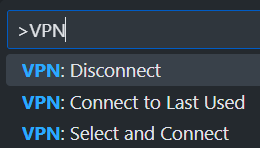

# VS Code VPN Toggle for Windows

A Visual Studio Code extension to easily toggle Windows VPN connections on/off.

## ⚙️ Prerequisites

- Windows 10 or later

- Configured VPN connections in Windows

## ✅ Features

The extension provides three commands:

- `VPN: Select and Connect` - Shows a list of available VPN connections to choose from
- `VPN: Connect to Last Used` - Connects to the most recently used VPN
- `VPN: Disconnect Current` - Disconnects the current VPN connection

Access these commands through the Command Palette (Ctrl+Shift+P):

## 🚚 Release Notes

### 0.0.6

Show progress indicator when running each command

### 0.0.5

Add Win32 OS to extension manifest

### 0.0.4

Fix regression

### 0.0.3

Show "Select and Connect" command first

### 0.0.2

Support VS Code engines v1+

### 0.0.1

Initial release

---
